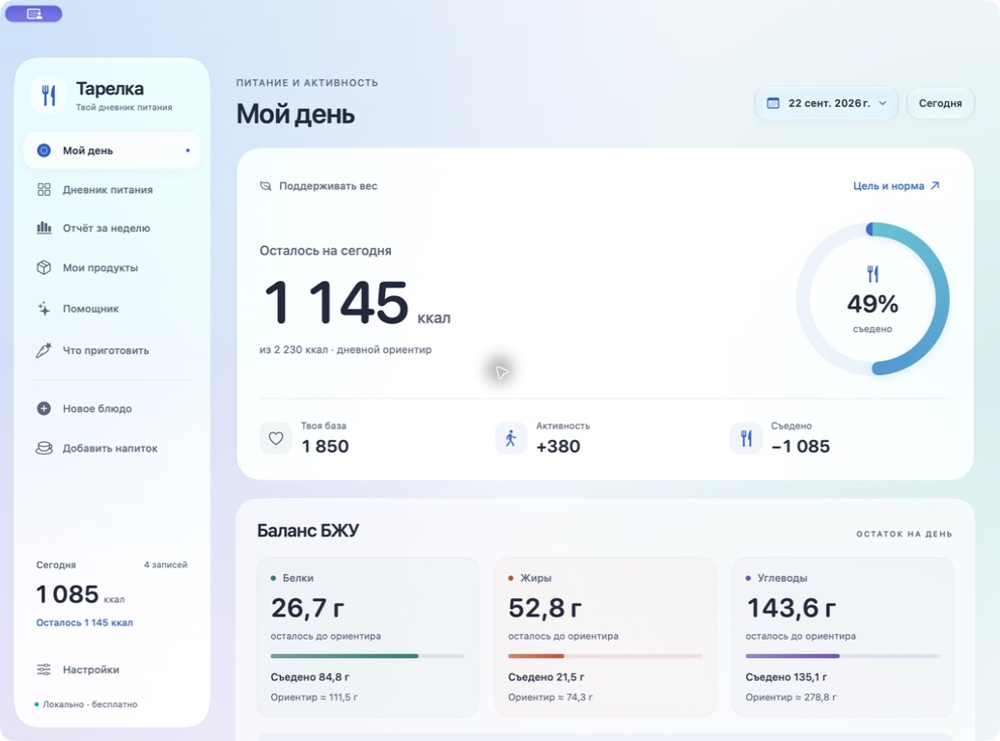
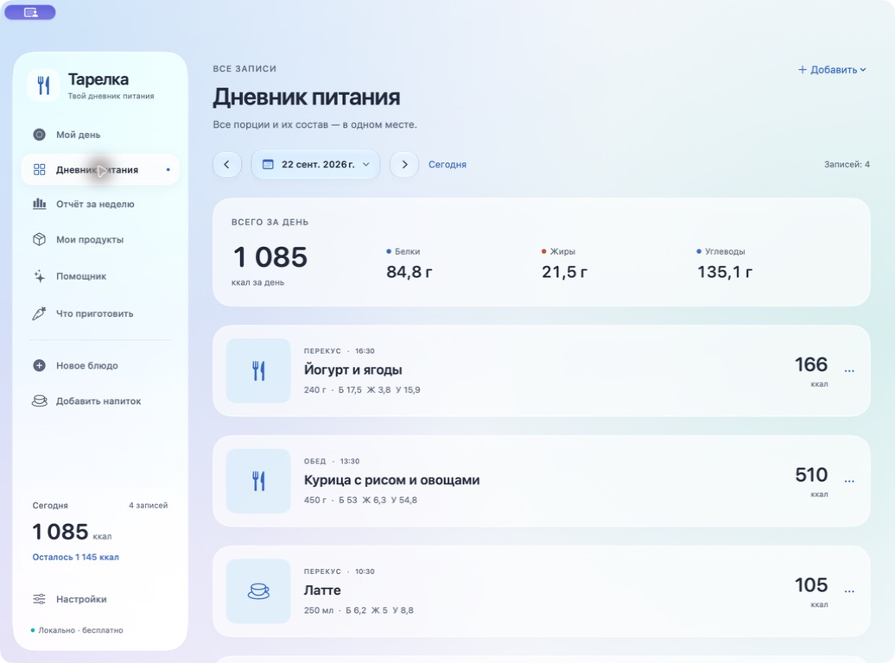
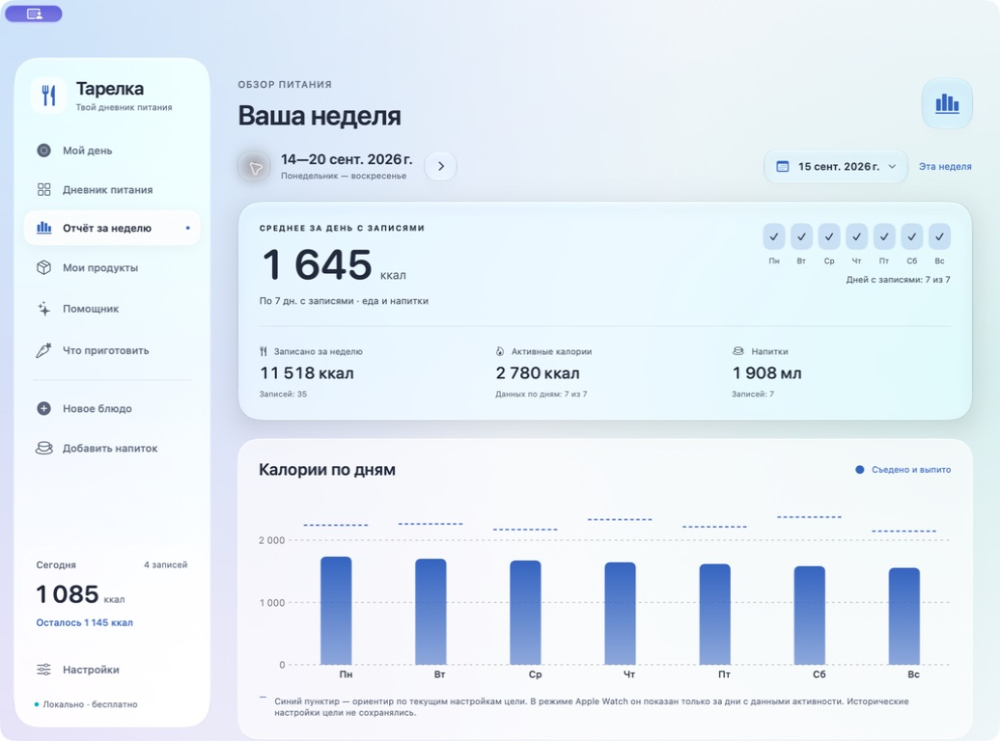
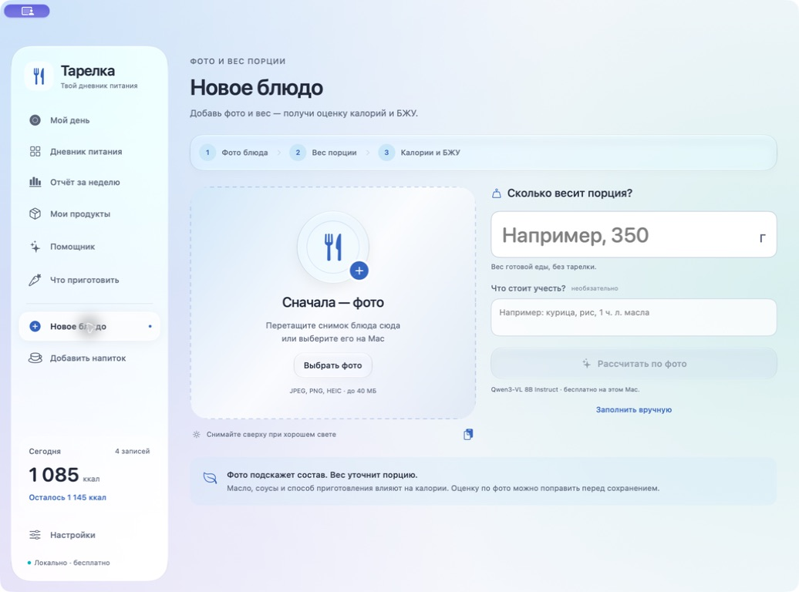

<div align="center">

# Тарелка

### Дневник питания, который живёт на твоём Mac

Фото блюда, вес порции, калории и БЖУ — в нативном приложении с Liquid Glass и локальным ИИ.

**macOS 14+ · SwiftUI · Русский интерфейс · Версия 2.3.3**

[Начать](#начать) · [Возможности](#возможности) · [Скриншоты](#скриншоты) · [Apple Watch](docs/AppleWatch.md) · [Для разработчиков](#для-разработчиков)



</div>

«Тарелка» помогает вести питание без подписки: записывать блюда и напитки, учитывать активность, смотреть остаток белков, жиров и углеводов и собирать отчёт за неделю. Распознавание еды и помощник по умолчанию используют модели на самом Mac через Ollama. Для ручного дневника нейросеть вообще не нужна.

> Фото даёт приблизительную оценку. Вес порции, подтверждение ингредиентов и данные с упаковки помогают сделать запись точнее. Перед сохранением результат можно исправить.

## Возможности

| | Что умеет приложение |
| --- | --- |
| **Еда по фото** | Фото + вес готовой порции → состав, калории и БЖУ. Можно добавить примечание и ответить на уточняющие вопросы. |
| **Ингредиенты отдельно** | Своя граммовка для каждого продукта: например, 70 г сосиски и 40 г сыра. Общий вес пересчитывается автоматически. |
| **Упаковки** | Ручной ввод или распознавание таблицы пищевой ценности через Apple Vision. Проверка значений перед переносом в продукт. |
| **Напитки** | Учёт в миллилитрах, значения на 100 мл, вода, сохранённые напитки и оценка по фото. |
| **Мои продукты** | Личная библиотека продуктов и напитков. Встроенный офлайн-справочник USDA на 7 793 позиции. |
| **Дневная норма** | Профиль с ростом, весом, возрастом и полом; цель или ручной ориентир. Остаток калорий и каждого макронутриента. |
| **Активность** | Ручной ввод, импорт Apple Health XML или подключение JSON-файла с активными калориями. |
| **Дневник и неделя** | История, редактирование записей, календарь, график питания, БЖУ, напитки и активность за неделю. |
| **Помощник** | Советы с учётом записей и цели. Генерация запускается по запросу; изменение активности не вызывает новый ответ автоматически. |
| **Что приготовить** | Список доступных продуктов текстом, фотографией или голосом; предложения блюд через локальную модель. |
| **Диктовка** | Русская речь на устройстве, индикатор голоса, сохранение предыдущих фраз после паузы. |
| **Интерфейс** | Светлая, тёмная и системная темы; Liquid Glass на macOS 26+, адаптация для ранних версий и уменьшения движения. |
| **Напоминания** | Уведомления о приёмах пищи по выбранному расписанию. |

## Скриншоты

Все записи на скриншотах вымышленные. Личный дневник и фотографии владельца проекта в репозиторий не входят.

### Дневник питания



### Отчёт за неделю



### Новое блюдо



## Начать

### 1. Собрать приложение

Потребуется **Mac и Xcode 26 или новее с macOS SDK 26+**. Минимальная версия запуска приложения — macOS 14; нативный Liquid Glass доступен на macOS 26+. Используется Swift Package Manager, сторонних Swift-пакетов нет.

```sh
git clone https://github.com/Mas562/tarelka.git
cd tarelka
zsh scripts/build-app.sh
```

После сборки откройте `dist/Тарелка.app`. Его можно перенести в «Программы». Для переноса между компьютерами скрипт также создаёт `dist/Тарелка.zip`.

Сборка выполняется под архитектуру текущего Mac. Проект проверялся на Apple Silicon; работа на Intel отдельно не проверялась. Скрипт создаёт локальную ad-hoc подпись. Это не подписанный Developer ID и не нотарифицированный дистрибутив App Store.

### 2. Начать вести дневник

Ручной ввод, библиотека продуктов, сканирование упаковок и отчёты доступны без Ollama и без ключей API.

1. Откройте **Мой день → Цель и норма** и заполните профиль либо задайте ручную норму.
2. В **Новом блюде → Заполнить вручную** добавьте продукты и их вес.
3. Для напитка выберите **Добавить напиток** и укажите объём в миллилитрах.
4. Сохраните запись — она попадёт в дневник, дневной баланс и недельный отчёт.

### 3. Включить бесплатный локальный ИИ

Установите [Ollama для macOS](https://ollama.com/download/mac), запустите её и откройте **Настройки** «Тарелки». Выберите **Бесплатно на Mac**, загрузите модели и проверьте готовность.

| Назначение | Модель | Размер загрузки, примерно |
| --- | --- | --- |
| Фото еды, напитков и продуктов; рецепты | `qwen3-vl:8b-instruct` | 6,1 ГБ |
| Помощник по питанию | `qwen3:4b-instruct-2507-q4_K_M` | 2,5 ГБ |

При желании модели можно загрузить в терминале:

```sh
ollama pull qwen3-vl:8b-instruct
ollama pull qwen3:4b-instruct-2507-q4_K_M
```

Для обеих моделей заложите около 10–12 ГБ свободного места с запасом. Практичный ориентир для локального распознавания — Apple Silicon и 16 ГБ памяти или больше. Время ответа зависит от Mac, размера изображения и нагрузки; моментальный результат не гарантируется.

Интернет нужен для первоначальной загрузки Ollama и моделей. После этого локальный режим работает без аккаунта и API-ключа. Ollama должна быть запущена; приложение обращается к `127.0.0.1:11434`.

В настройках также есть необязательный облачный провайдер OpenAI. Для него нужен собственный API-ключ и оплата API; он не требуется для бесплатного режима.

## Как получить более точную запись

1. Взвесьте готовую еду **без посуды**.
2. Снимите блюдо сверху при хорошем освещении. Выберите фото, перетащите его в окно или вставьте через **⌘⇧V**.
3. Укажите вес и детали, которые не видны на фото: масло, соус, сахар, способ приготовления.
4. Запустите расчёт. Если появились вопросы, уточните состав и пересчитайте результат.
5. Проверьте ингредиенты и их значения. Для знакомого продукта используйте библиотеку или данные конкретной упаковки.
6. Выберите дату и приём пищи, затем сохраните.

По умолчанию после определения состава нужно подтвердить пищевую ценность из справочника USDA или своих продуктов. Приблизительные значения самой модели доступны отдельным режимом в настройках.

Режим общего веса пропорционально меняет граммовку ингредиентов без нового обращения к модели. При необходимости переключитесь на отдельный вес каждого ингредиента.

**Данные упаковки.** Калории и БЖУ вводятся на **100 г** или **100 мл**, а не на всю порцию. В **Моих продуктах → С фото упаковки** таблицу распознаёт встроенный Apple Vision: бесплатно, на Mac, без Ollama. Поддерживаются русский и английский текст. Проверьте четыре значения и единицу перед подтверждением; неясные поля не заменяются выдуманными нулями.

Если известны только БЖУ, можно включить приблизительный расчёт калорий `4 × белки + 9 × жиры + 4 × углеводы`. Калории, напечатанные на упаковке, предпочтительнее этой оценки. Подробнее: [распознавание и проверка результата](docs/Recognition.md).

## Калории, БЖУ и движение

Приложение предлагает два способа учёта:

- **Покой + Apple Watch** — базовый расход плюс активные калории выбранного дня с учётом цели. Коэффициент активности дополнительно не применяется.
- **Обычная активность** — базовый расход с коэффициентом активности. Калории часов показываются отдельно и повторно не увеличивают норму.

```text
Остаток = дневная норма с учётом активности и цели − съеденное

Пример с ручной базой:
2500 ккал базы + 300 ккал активности − 500 ккал еды = 2300 ккал осталось
```

Часы увеличивают доступный остаток в соответствующем режиме; количество уже съеденного остаётся прежним. Если показаний за день нет, приложение отмечает это отдельно.

Базовый расход рассчитывается по формуле Миффлина — Сан Жеора. Цели БЖУ в текущей версии распределяют дневной ориентир как **20% белков, 30% жиров и 50% углеводов**, с переводом в граммы через 4/9/4 ккал. Рост и вес влияют на энергетическую норму, а через неё — на БЖУ; это не индивидуальный спортивный расчёт граммов белка на килограмм веса. Подсказки по остатку БЖУ формируются локально без запроса к нейросети.

Это ориентиры для учёта, а не медицинское назначение или обещание похудения за определённый срок.

### Apple Watch, включая старые модели

«Тарелка» получает дневные итоги **через iPhone или файл**, а не напрямую с часов. Отдельное приложение на Apple Watch устанавливать не нужно. Поэтому механизм не требует новых watchOS-функций и может использовать данные Series 3, уже синхронизированные в «Здоровье» на связанном iPhone.

Доступны три варианта:

1. Ввести активные калории вручную из красного кольца «Подвижность».
2. Перенести экспорт «Здоровья» через AirDrop и импортировать `export.xml`.
3. Настроить JSON-файл через «Команды» на iPhone и подключить его на Mac. Приложение перечитывает подключённый файл примерно раз в минуту, пока открыто, и при следующем запуске.

Повторный импорт обновляет дневной итог, не складывает одну и ту же активность несколько раз. Работа импорта проверена на тестовых файлах; полный перенос с реальных часов и iPhone отдельно не подтверждён.

[Пошаговая настройка Apple Watch → iPhone → Mac](docs/AppleWatch.md)

## Голос и помощник

В **Что приготовить → Продиктовать продукты** можно назвать ингредиенты вслух. Нужны разрешения macOS на микрофон и распознавание речи. Используется распознавание на устройстве; при его недоступности можно ввести текст вручную. Один сеанс ограничен 60 секундами. Пауза между словами не должна стирать уже продиктованные фразы; запись аудио в дневнике не сохраняется.

Помощник видит контекст питания и выбранную цель. Новые ответы создаются по явному запросу. Для текстовой модели ограничена нагрузка на процессор, запросы к локальному ИИ выполняются по очереди, а модель помощника освобождается после завершения. Это снижает фоновую нагрузку, но генерация всё равно потребляет ресурсы Mac.

[Подробности производительности](docs/Performance.md)

## Данные и приватность

В локальном режиме фотографии и контекст питания обрабатываются на Mac. Дневник не требует аккаунта, собственного сервера или облачной базы данных.

| Данные | Где хранятся |
| --- | --- |
| Блюда и напитки | `~/Library/Application Support/Tarelka/meals.json` |
| Профиль, продукты, активность | `~/Library/Application Support/Tarelka/personal.json` |
| Фотографии блюд | `~/Library/Application Support/Tarelka/Photos/` |
| Настройки интерфейса | UserDefaults macOS |
| Необязательный ключ OpenAI | Связка ключей macOS |
| Модели Ollama | Хранилище Ollama, обычно `~/.ollama/models/` |

Перед обработкой изображения уменьшаются и перекодируются без исходных метаданных, включая GPS. В облачном режиме выбранная фотография и данные запроса отправляются OpenAI — только при использовании этого провайдера.

Для резервной копии закройте приложение и скопируйте папку `Tarelka` целиком, включая `Photos`. Репозиторий не содержит дневника, модели, ключей API, экспортов Apple Health или временных сборок; соответствующие пути исключены через `.gitignore`.

## Для разработчиков

```text
Sources/
├── NutritionCore/          # Расчёты, хранение, импорт, модели, распознавание
│   └── Resources/          # Локальный справочник USDA и его источник
└── Tarelka/                # SwiftUI, AppKit, Vision, Speech, уведомления
Tests/
├── NutritionCoreTests/     # Формулы, форматы, импорт, модельные запросы
└── TarelkaTests/           # Состояния приложения, календарь, диктовка
packaging/                  # Info.plist и генерация иконки
scripts/                    # Сборка, тесты, импорт справочника
docs/                       # Инструкции, ограничения и скриншоты
```

Откройте `Package.swift` в Xcode либо используйте команды:

```sh
zsh scripts/test.sh
zsh scripts/build-app.sh
```

Скрипты выбирают готовый Xcode или доступные Command Line Tools. Для явного выбора инструментов можно задать `DEVELOPER_DIR` и `SDKROOT`. Вариант с CLT зависит от наличия совместимого SDK; основной путь для новой установки — полноценный Xcode.

Перед публикацией версии 2.3.3 пройдены **96 тестов в 16 наборах**. Набор проверок охватывает арифметику порций и БЖУ, напитки, импорт активности, недельные отчёты, обработку ответов моделей, сохранение диктовки после пауз и календарные переходы. Тесты используют контролируемые данные и не заменяют проверку качества распознавания реальных блюд.

Для изолированного тестового дневника задайте `TARELKA_DATA_DIR` перед запуском исполняемого файла. Эта переменная меняет папку дневника и профиля; настройки macOS и Keychain остаются связанными с идентификатором приложения.

### Источник справочника

Встроенный справочник основан на **USDA FoodData Central, SR Legacy**. Это общие продукты и способы приготовления, а не база всех торговых марок. Данные конкретной упаковки могут отличаться.

Источник, версия и условия распространения: [USDA-SOURCE.txt](Sources/NutritionCore/Resources/USDA-SOURCE.txt). Скрипт повторного импорта официального CSV-архива: `scripts/import-usda.py`.

## Если что-то не работает

| Ситуация | Что проверить |
| --- | --- |
| Модель не отвечает | Ollama запущена, нужная модель скачана, проверка готовности в настройках проходит. |
| Mac медленно отвечает во время анализа | Свободную память и другие тяжёлые задачи. Отмените генерацию; ручной ввод доступен без модели. |
| Блюдо распознано неверно | Уточните ингредиенты и приготовление; замените значения данными упаковки или подтверждённым продуктом из справочника. |
| Калории часов не увеличили остаток | Режим учёта, выбранную дату и свежесть активности. В режиме обычной активности они повторно не прибавляются. |
| Не работает диктовка | Разрешения микрофона и речи, доступность распознавания на устройстве. |
| Среднее за неделю отличается от суммы / 7 | В среднее входят дни с записями. Пустой день не считается нулевым рационом. |
| Нет Liquid Glass | Версию macOS: на macOS 14–15 используется совместимое оформление. |

## Обратная связь

Нашли ошибку — [создайте issue](https://github.com/Mas562/tarelka/issues) с версией приложения, macOS, моделью Mac и шагами воспроизведения. Для проблем ИИ укажите имя модели и ожидаемый результат. Перед публикацией скриншотов и файлов уберите личные данные, ключи и экспорт «Здоровья».

История отдельных изменений: [2.2](docs/Исправления-2.2.md), [2.3](docs/Новые-функции-2.3.md), [2.3.1](docs/Исправления-2.3.1.md), [2.3.2](docs/Исправления-2.3.2.md). В 2.3.3 появился новый календарь во всех формах выбора даты.
